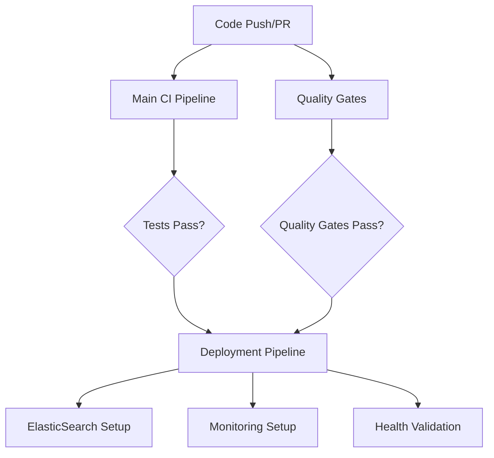

# GitHub Actions Workflows

This directory contains the consolidated CI/CD pipeline for the AI Service project. The workflows have been streamlined from 6 separate workflows to 3 comprehensive workflows for better maintainability and efficiency.

## Workflow Overview

### 🔄 Main CI Pipeline (`main-ci.yml`)
**Purpose**: Core testing, coverage, and security scanning
**Triggers**: Push to main/develop, Pull requests, Daily schedule
**Jobs**:
- **Tests & Coverage**: Unit/integration tests with coverage reporting
- **Security Analysis**: Bandit, Safety, pip-audit scanning with gates
- **Canary Tests**: Scheduled performance regression detection

**Key Features**:
- Deterministic testing with `PYTHONHASHSEED=0`
- Comprehensive coverage reporting (70% threshold)
- Enhanced security scanning with multiple tools
- Artifact collection for all test results
- PR comment integration for visibility

### 🎯 Quality Gates (`quality-gates.yml`)
**Purpose**: Advanced quality assurance and parity validation
**Triggers**: Push/PR on src changes, Manual dispatch
**Jobs**:
- **Golden Parity Tests**: Legacy vs factory normalization validation
- **ASCII Fastpath Parity**: ASCII processing performance validation
- **Performance Benchmarks**: Latency and memory usage validation
- **Search Integration Tests**: ElasticSearch and hybrid search validation

**Key Features**:
- Shadow mode testing for safe feature rollouts
- Performance thresholds enforcement (P95 < 10ms, P99 < 20ms)
- Search system integration with real ElasticSearch
- Comprehensive validation gates with configurable thresholds

### 🚀 Deployment & Monitoring (`deployment.yml`)
**Purpose**: Production deployment and monitoring setup
**Triggers**: Push to main/develop, Manual dispatch, Workflow completion
**Jobs**:
- **Pre-Deployment Validation**: Smoke tests and critical path validation
- **ElasticSearch Deployment**: Index setup, data loading, system warmup
- **Monitoring Setup**: Prometheus, Grafana, alerting configuration
- **Post-Deployment Validation**: Health checks and production readiness

**Key Features**:
- Multi-environment support (staging/production)
- Force deployment option for emergency scenarios
- Comprehensive monitoring stack deployment
- End-to-end health validation
- Detailed deployment reporting

## Migration from Legacy Workflows

### Archived Workflows (moved to `archive/`)
- `ci.yml` → Consolidated into `main-ci.yml`
- `security.yml` → Consolidated into `main-ci.yml`
- `golden-test-monitor.yml` → Consolidated into `quality-gates.yml`
- `parity_and_perf_gate.yml` → Consolidated into `quality-gates.yml`
- `ascii-fastpath-parity.yml` → Consolidated into `quality-gates.yml`
- `search-deployment.yml` → Consolidated into `deployment.yml`

### Key Improvements in Consolidation
1. **Reduced Complexity**: 6 → 3 workflows with clearer responsibility separation
2. **Enhanced Security**: Added pip-audit, improved reporting, configurable thresholds
3. **Better Observability**: Structured JSON reports, comprehensive artifact collection
4. **Improved Performance**: Consolidated dependency installation, better caching
5. **Enhanced Monitoring**: Integrated Prometheus/Grafana setup in deployment

## Workflow Dependencies and Triggers



## Environment Variables and Secrets

### Required Secrets
- `SEMGREP_APP_TOKEN`: Semgrep SAST analysis token
- `CODECOV_TOKEN`: Code coverage reporting token (optional)

### Key Environment Variables
- `PYTHONHASHSEED=0`: Deterministic test execution
- `SHADOW_MODE=true`: Safe feature testing mode
- `USE_FACTORY_NORMALIZER=true`: Factory normalization enabled
- `ELASTICSEARCH_URL`: ElasticSearch cluster URL
- `DEBUG_TRACE=true/false`: Trace logging control

## Quality Gates and Thresholds

### Security Gates
- **Bandit**: ≤5 high-severity issues
- **Safety**: 0 known vulnerabilities
- **pip-audit**: Advisory scanning enabled

### Performance Gates
- **P95 Latency**: ≤10ms (relaxed for complex workloads)
- **P99 Latency**: ≤20ms (relaxed for complex workloads)
- **Memory Usage**: ≤100MB per request
- **Coverage**: ≥70% for core components

### Parity Gates
- **Golden Parity**: ≥80% similarity between legacy and factory
- **ASCII Fastpath**: ≥95% parity for ASCII processing

## Artifact Management

### Artifact Retention
- **Test Results**: 14 days
- **Security Reports**: 30 days
- **Deployment Artifacts**: 30 days
- **Performance Reports**: 14 days

### Key Artifacts
- `coverage-reports-{run_number}`: Test coverage data
- `security-reports-{run_number}`: Security scan results
- `golden-parity-reports-{run_number}`: Parity validation results
- `performance-reports-{run_number}`: Performance benchmark data
- `deployment-reports-{run_number}`: Deployment validation results

## Troubleshooting

### Common Issues

#### 1. Security Gate Failures
```bash
# Check Bandit results
cat artifacts/security/bandit-report.json

# Review Safety vulnerabilities
cat artifacts/security/safety-report.json
```

#### 2. Parity Test Failures
```bash
# Check golden parity results
cat artifacts/golden/golden-test-results.json

# Review ASCII parity scores
cat artifacts/ascii/ascii-parity-results.json
```

#### 3. Deployment Issues
```bash
# Check ElasticSearch connectivity
curl -f http://localhost:9200/_cluster/health

# Review deployment validation
cat artifacts/deployment/elasticsearch-validation.txt
```

### Performance Issues
- **Slow Tests**: Check if spaCy models are properly cached
- **High Memory**: Review memory profiling in performance artifacts
- **ElasticSearch Timeout**: Increase health check timeout in service config

## Monitoring and Alerts

### Prometheus Metrics
- `ai_service_request_duration_seconds`: API request latency
- `ai_service_request_total`: Request count and rate
- `ai_service_errors_total`: Error count by type
- `elasticsearch_cluster_health`: ES cluster status

### Grafana Dashboards
- **API Performance**: Request latency, rate, errors
- **Search Metrics**: Search latency, success rate
- **System Health**: CPU, memory, disk usage
- **Business Metrics**: Normalization success, signal accuracy

### Alert Rules
- **Critical**: API P95 > 100ms, Error rate > 5%, Memory > 90%
- **Warning**: API P95 > 50ms, Error rate > 2%, Memory > 75%

## Development Workflow

### For Feature Development
1. Create feature branch
2. `main-ci.yml` runs on PR creation
3. `quality-gates.yml` runs on src changes
4. Review artifacts and address any failures
5. Merge triggers deployment pipeline

### For Deployment
1. Ensure all quality gates pass
2. Manual trigger `deployment.yml` for production
3. Monitor health checks and validation
4. Review deployment summary report

### For Debugging
1. Check workflow run artifacts
2. Review structured JSON reports
3. Analyze performance and security data
4. Use PR comments for team visibility