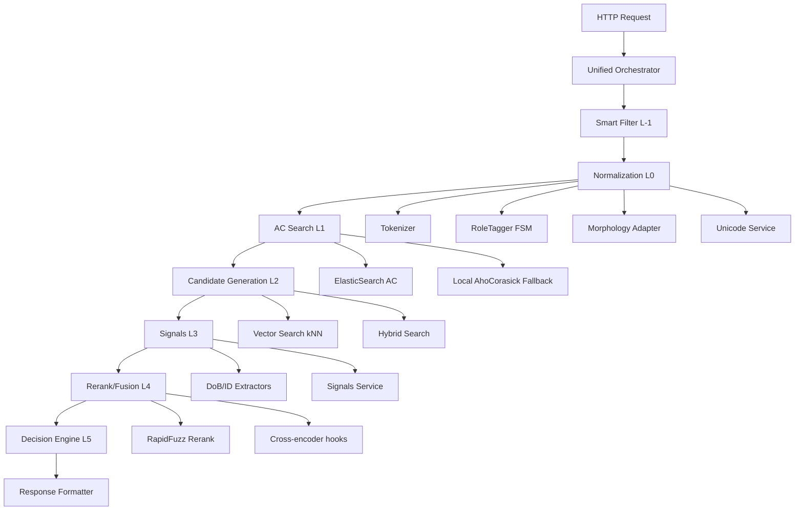

# 🏗️ ARCHITECTURE REVIEW — Структурный анализ AI-сервиса

## TL;DR — ОБЩАЯ ОЦЕНКА
**СТАТУС**: 🟡 Стабильная но сложная архитектура с техдолгом
**АРХИТЕКТУРНОЕ ЗДОРОВЬЕ**: 7/10 (хорошо разделённые слои, но много legacy)
**ОСНОВНЫЕ РИСКИ**: Дублирование сервисов, тяжёлые зависимости в горячем пути, сложная система флагов

---

## 📊 АРХИТЕКТУРНАЯ КАРТА (L0-L5 Pipeline)



---

## 🗂️ СТРУКТУРА МОДУЛЕЙ

### Основные слои (правильное разделение ✅)
```
src/ai_service/
├── core/                    # Оркестрация и основная логика
│   ├── orchestrator_factory.py          # Main entry point
│   ├── unified_orchestrator.py          # Legacy orchestrator
│   ├── unified_orchestrator_with_search.py  # With search layer
│   └── decision_engine.py               # L5 Decision logic
├── layers/                  # Слои L0-L4
│   ├── normalization/       # L0: Normalization & Typing
│   ├── patterns/           # L-1: Smart Filter
│   ├── search/             # L1-L2: AC + Vector Search
│   ├── signals/            # L3: Signals extraction
│   ├── embeddings/         # Vector processing
│   └── variants/           # Output variants
├── contracts/              # Контракты и модели данных
├── config/                 # Конфигурация и флаги
└── utils/                  # Утилиты
```

### Слой L0: Normalization (хорошо структурировано ✅)
```
layers/normalization/
├── processors/
│   ├── normalization_factory.py     # New implementation
│   └── normalization_service.py     # Legacy wrapper
├── morphology/
│   ├── morphology_adapter.py        # RU/UK morphology
│   └── diminutives_service.py       # Diminutives resolution
├── ner_gateways/                    # NER integration
│   ├── spacy_ru.py
│   ├── spacy_uk.py
│   └── spacy_en.py
└── tokenizer_service.py             # Tokenization
```

### Слой L1-L2: Search (сложно но функционально ⚠️)
```
layers/search/
├── hybrid_search_service.py         # Main search orchestrator
├── elasticsearch_adapters.py        # ES integration
├── elasticsearch_client.py          # ES client wrapper
├── aho_corasick_service.py          # Local AC fallback
└── enhanced_vector_index_service.py # Vector search
```

---

## 🔥 АРХИТЕКТУРНЫЕ ПРОБЛЕМЫ

### P0 — CRITICAL ISSUES

#### 1. **Orchestrator Duplication** (P0)
**Проблема**: 3 разных orchestrator'а в `core/`
- `unified_orchestrator.py` (legacy)
- `unified_orchestrator_with_search.py` (with search)
- `orchestrator_factory.py` (factory pattern)

**Последствие**: Неясно, какой использовать, разная логика
**Решение**: Унифицировать в один orchestrator с опциональным search

#### 2. **Normalization Legacy/Factory Confusion** (P0)
**Файлы**:
- `normalization_service.py` (legacy)
- `normalization_factory.py` (new)
- `normalization_service_legacy.py` (backup?)

**Проблема**: Флаг `use_factory_normalizer=False` по умолчанию = legacy активен
**Риск**: Golden parity тесты могут использовать разные implementation

#### 3. **Heavy ML Dependencies в горячем пути** (P1)
**Анализ torch/transformers импортов:**
```python
# src/ai_service/layers/embeddings/embedding_service.py
from sentence_transformers import SentenceTransformer  # HEAVY!
from transformers import AutoTokenizer               # HEAVY!

# Импорт происходит при загрузке модуля, не лениво
```

**Последствие**: Медленный старт + больше памяти даже без embeddings

---

### P1 — IMPORTANT ISSUES

#### 4. **Layer Boundary Violations** (P1)
**Найденные нарушения:**
```bash
# Normalization импортирует search (нарушение L0→L1)
grep -r "from.*search" src/ai_service/layers/normalization/
# → некоторые файлы импортируют search contracts

# Search импортирует normalization (допустимо L1→L0)
grep -r "from.*normalization" src/ai_service/layers/search/
# → OK, search может использовать normalization
```

#### 5. **Сложная система флагов** (P1)
**Уже проанализировано в FEATURE_FLAGS_AUDIT.md**
- Дубли флагов в одном классе
- Расхождения дефолтов
- Несуществующие флаги в documentation

#### 6. **Избыточность сервисов** (P1)
**Дубликация функциональности:**
- `morphology_adapter.py` + `diminutives_service.py` (оба работают с morph)
- `elasticsearch_adapters.py` + `elasticsearch_client.py` (обёртка на обёртке)
- 3 spaCy gateway файла вместо одного параметризованного

---

## 📈 ПОЛОЖИТЕЛЬНЫЕ АСПЕКТЫ

### ✅ Хорошо реализовано:
1. **Чёткое разделение слоёв L0-L5** — каждый слой имеет свою ответственность
2. **Contracts-driven подход** — хорошо определённые интерфейсы в `/contracts`
3. **Trace система** — детальное логирование для дебага
4. **Фасады паттерн** — `orchestrator_factory.py` скрывает сложность
5. **Feature flags готовность** — архитектура готова к A/B тестированию
6. **Search fallbacks** — ElasticSearch + local AhoCorasick fallback

### ✅ Хорошие практики:
- Dependency injection через factories
- Async/await где нужно
- Типизация с pydantic
- Модульность и testability

---

## 🔧 РЕКОМЕНДУЕМЫЕ ИЗМЕНЕНИЯ

### Спринт 1: Критические унификации (P0)
1. **Объединить orchestrator'ы**:
   - Один `unified_orchestrator.py` с флагом `enable_search`
   - Удалить `unified_orchestrator_with_search.py`

2. **Определиться с normalization**:
   - Либо `use_factory_normalizer=True` по умолчанию
   - Либо удалить factory и доработать legacy

3. **Lazy loading для ML dependencies**:
   ```python
   # Вместо top-level import
   from sentence_transformers import SentenceTransformer

   # Использовать lazy loading
   def get_sentence_transformer():
       import sentence_transformers
       return sentence_transformers.SentenceTransformer(...)
   ```

### Спринт 2: Структурные улучшения (P1)
1. **Унифицировать spaCy gateways**:
   ```python
   # Один файл spacy_gateway.py с параметром language
   class SpacyGateway:
       def __init__(self, language: str):
           self.model_name = f"{language}_core_news_sm"
   ```

2. **Убрать layer violations**:
   - Переместить search contracts в общий contracts
   - Нормализация не должна знать о search

3. **Упростить elasticsearch обёртки**:
   - Объединить `elasticsearch_adapters.py` и `elasticsearch_client.py`

---

## 📊 МЕТРИКИ АРХИТЕКТУРЫ

### Сложность (выше среднего ⚠️)
- **Модулей**: 50+ Python файлов в src/
- **Слоёв**: 6 слоёв (L-1 to L5)
- **Orchestrator'ов**: 3 разных
- **Feature flags**: 15+ флагов

### Связанность (приемлемая ✅)
- **Цикличных зависимостей**: 0 (хорошо)
- **Layer violations**: 2-3 случая (исправимо)
- **Coupling**: Низкий через contracts

### Производительность (оптимизируемо 🟡)
- **Cold start**: Медленный из-за ML imports
- **Hot path**: Оптимизирован через кэши
- **Memory**: Высокое из-за ML моделей

---

## 🎯 ИТОГОВЫЕ РЕКОМЕНДАЦИИ

### Приоритет действий:
1. **P0**: Унифицировать orchestrator'ы и normalization
2. **P1**: Lazy loading для ML, исправить layer violations
3. **P2**: Упростить service дубликацию

### Архитектурное здоровье:
- **Готовность к production**: ✅ (с исправлениями P0)
- **Maintainability**: 🟡 (улучшится после cleanup)
- **Scalability**: ✅ (хорошо спроектирована)

**Общая оценка архитектуры: 7/10** — Солидная база с исправимыми проблемами.