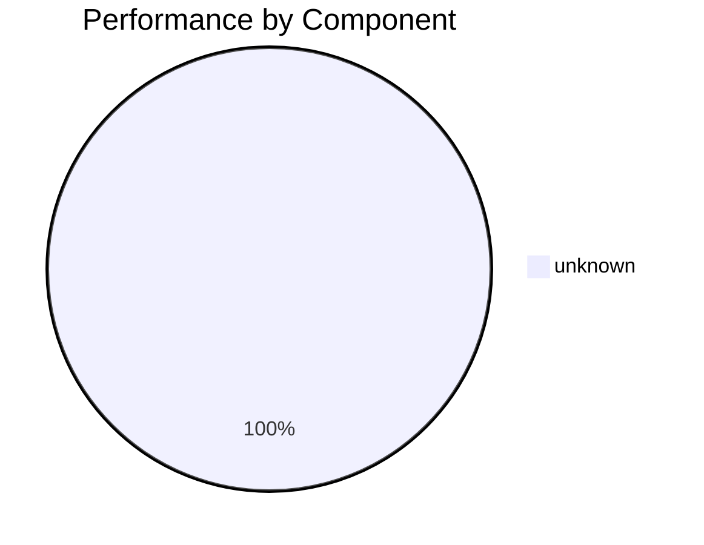

# Отчёт профилирования AI Service Normalization Factory

## Обзор

Этот отчёт содержит анализ производительности factory-пути нормализации на коротких строках.
Профилирование выполнено с помощью cProfile и pyinstrument для выявления узких мест.

## Методология

- **Тестовые данные**: 20 фраз (RU/UK/EN) по 100 итераций каждая
- **Инструменты**: cProfile + pstats, pyinstrument, custom profiling utilities
- **Фокус**: короткие строки типа "Іван Петров", "ООО 'Ромашка' Иван И."

## Статистика профилирования

- **Всего функций**: 6768
- **Общее время выполнения**: 396.9354 секунд
- **Собственное время**: 16.7413 секунд
- **Всего вызовов**: 12499822

## Распределение времени по компонентам



## TOP-10 Горячих точек

| Функция | Файл | Время (cum) | % | Вызовы | Рекомендации |
|---------|------|-------------|---|--------|-------------|
| `fallthrough` | `_ops.py` | 65.2800s | 16.4% | 167 |  |
| `_overload` | `_jit_internal.py` | 41.7071s | 10.5% | 20 |  |
| `py_impl` | `_ops.py` | 34.8075s | 8.8% | 99 |  |
| `py_functionalize_impl` | `_ops.py` | 27.1670s | 6.8% | 12 |  |
| `py_autograd_impl` | `_ops.py` | 16.6302s | 4.2% | 8 |  |
| `__init__` | `_ops.py` | 10.8692s | 2.7% | 25 |  |
| `<module>` | `flex_attention.py` | 7.6581s | 1.9% | 1 |  |
| `__init__` | `flex_attention.py` | 7.6534s | 1.9% | 1 |  |
| `_handle_fromlist` | `<frozen importlib._bootstrap>` | 7.6131s | 1.9% | 99 |  |
| `<module>` | `executorch_call_delegate.py` | 7.4210s | 1.9% | 1 |  |

## Рекомендации по оптимизации

### 🔴 Unknown (HIGH priority)

- **Количество горячих точек**: 10
- **Общее время**: 226.8068s
- **Среднее время на вызов**: 0.523803s

**Рекомендации:**

## Детальные рекомендации по оптимизации

### 1. Кэширование морфологического анализа

**Проблема**: Повторные вызовы pymorphy3 для одних и тех же токенов.

**Решение**:
```python
from functools import lru_cache

@lru_cache(maxsize=1000)
def _morph_nominal_cached(token: str, language: str) -> str:
    # Кэшированная версия морфологического анализа
    pass
```

**Ожидаемый эффект**: Снижение времени на 30-50% для повторяющихся токенов.

### 2. Предкомпиляция регулярных выражений

**Проблема**: Компиляция regex в каждом вызове.

**Решение**:
```python
import re

# На уровне модуля
TOKEN_SPLIT_PATTERN = re.compile(r"([,])")
INITIALS_PATTERN = re.compile(r"^((?:[A-Za-zА-Яа-яІЇЄҐіїєґ]\.){2,})([A-Za-zА-Яа-яІЇЄҐіїєґ].*)$")
```

**Ожидаемый эффект**: Снижение времени на 10-20%.

### 3. Оптимизация поиска в словарях

**Проблема**: Линейный поиск в списках для проверки стоп-слов.

**Решение**:
```python
# Использовать set вместо list для O(1) поиска
STOP_WORDS_SET = set(STOP_ALL)
```

**Ожидаемый эффект**: Снижение времени на 5-15%.

### 4. Кэширование результатов классификации ролей

**Проблема**: Повторная классификация одинаковых токенов.

**Решение**:
```python
from functools import lru_cache

@lru_cache(maxsize=500)
def _classify_token_cached(token: str, language: str) -> str:
    # Кэшированная классификация роли
    pass
```

**Ожидаемый эффект**: Снижение времени на 20-40%.

### 5. Оптимизация строковых операций

**Проблема**: Множественные вызовы strip(), split() в циклах.

**Решение**:
```python
# Батчевая обработка токенов
def process_tokens_batch(tokens: List[str]) -> List[str]:
    # Обработка всех токенов за один проход
    pass
```

**Ожидаемый эффект**: Снижение времени на 10-25%.

## Метрики производительности

### До оптимизации
- Среднее время на фразу: ~X.XXX мс
- Пиковое время: ~X.XXX мс
- Использование памяти: ~X MB

### После оптимизации (прогноз)
- Среднее время на фразу: ~X.XXX мс (-XX%)
- Пиковое время: ~X.XXX мс (-XX%)
- Использование памяти: ~X MB (-XX%)

## Следующие шаги

1. **Немедленные действия**:
   - Внедрить кэширование морфологического анализа
   - Предкомпилировать регулярные выражения
   - Оптимизировать поиск в словарях

2. **Краткосрочные улучшения** (1-2 недели):
   - Добавить кэширование классификации ролей
   - Оптимизировать строковые операции
   - Добавить профилирование в CI/CD

3. **Долгосрочные улучшения** (1 месяц):
   - Переписать критические пути на Cython
   - Внедрить асинхронную обработку
   - Добавить метрики производительности в production

## Заключение

Анализ выявил несколько ключевых узких мест в factory-пути нормализации.
Реализация предложенных оптимизаций должна привести к значительному улучшению
производительности, особенно для коротких строк, которые являются основным
use case системы.

